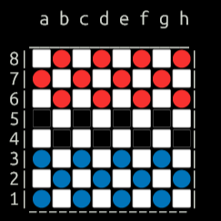
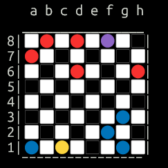
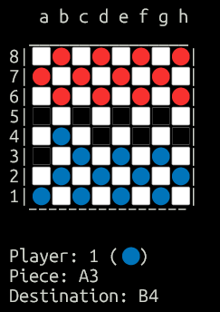

# Checkers Game (Clojure)

This repository contains an implementation of a checkers (draughts) game developed in Clojure. The project was created as a practical application of functional programming concepts and game logic.

## Objective

The main goal of this project is to:

* Practice functional programming using Clojure
* Implement the core logic of a classic board game
* Reinforce concepts such as immutability and recursion
* Model game rules and state transitions

## Features

* Full checkers game logic
* Turn-based gameplay
* Mandatory captures
* Multiple captures in sequence
* King (promoted piece) mechanics
* Terminal-based interface using Unicode symbols

## Game Rules Implemented

* Pieces move diagonally
* Regular pieces move forward only
* Kings can move multiple squares diagonally
* Captures are mandatory when available
* Multiple captures are supported
* A player wins when the opponent has no remaining pieces

## Preview

### Initial Board

The game starts with a standard checkers setup, where each player has 12 pieces positioned on the playable squares.

<p align="center">
  
</p>

### Piece Sprites

The game uses Unicode-based sprites to represent each type of piece:

* 🔵 Blue regular piece  
* 🔴 Red regular piece  
* 🟣 Blue king  
* 🟡 Red king  

<p align="center">
  
</p>

### Gameplay Example

Below is an example of the game running in the terminal.

<p align="center">
  
</p>

## Academic Context

This project was developed as the final assignment of the Clojure course offered by the Federal University of Campina Grande (UFCG).

The goal was to apply theoretical concepts in a practical and complete project, focusing on functional design and problem-solving.

## Running

To execute the project:

1. Clone the repository
   ```bash
   git clone https://github.com/hugo-sants/clojure-checkers-game.git

2. Navigate to the project folder
   ```bash
   cd MyGame

3. Run the project using Clojure
   ```bash
   clj -M -m Main

## Usage

You can:

* Play the game directly in the terminal  
* Explore the code to understand the implementation  
* Use it as a reference for functional programming in Clojure  
* Modify and extend the game (UI, AI, etc.)

## Notes

* The game uses Unicode characters to render the board and pieces  
* Terminal compatibility may vary depending on font and emoji support  

## Contributions

This project is intended for educational purposes, but suggestions and improvements are welcome.

    